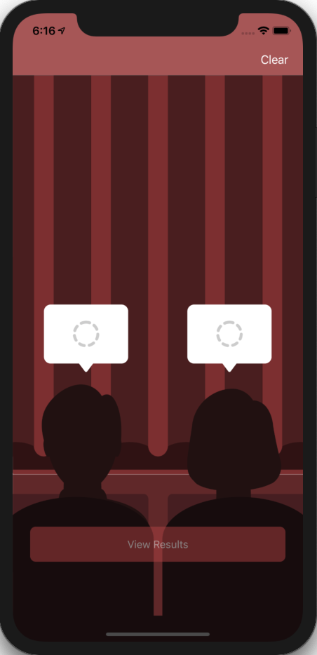
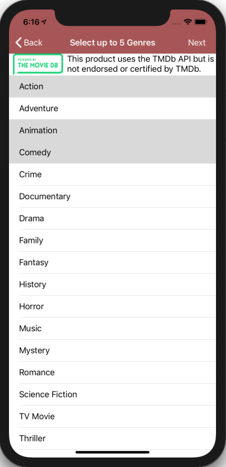
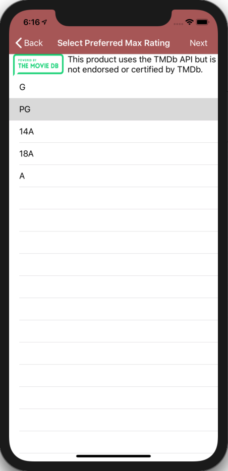
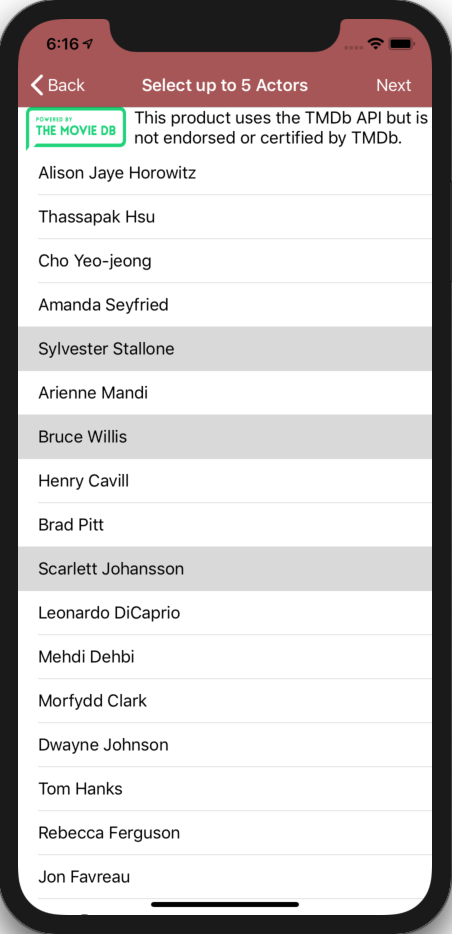
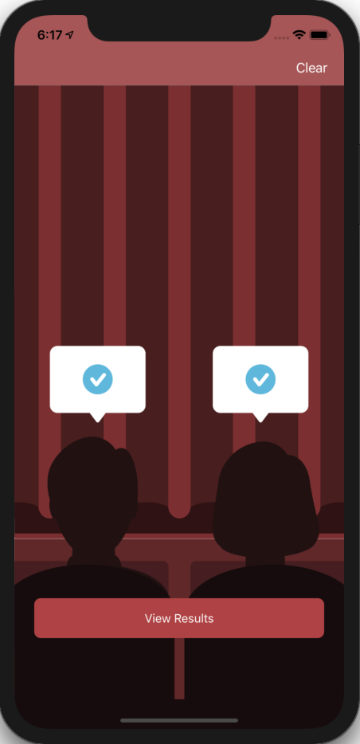
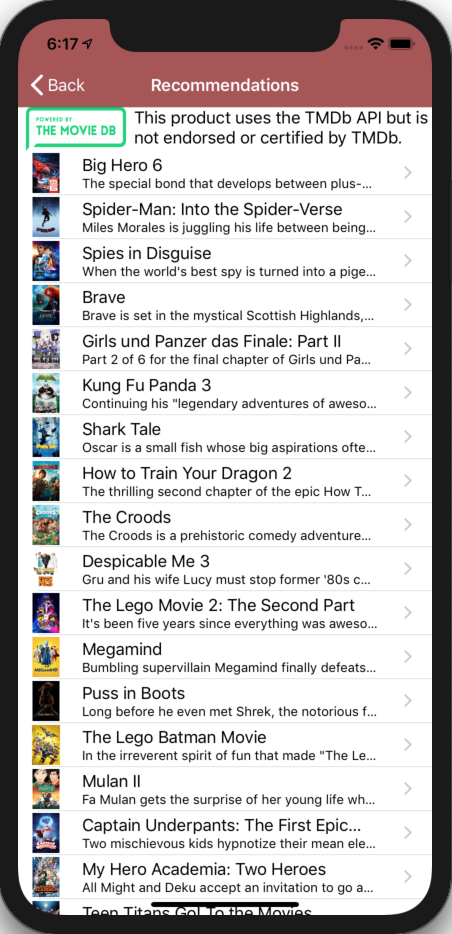
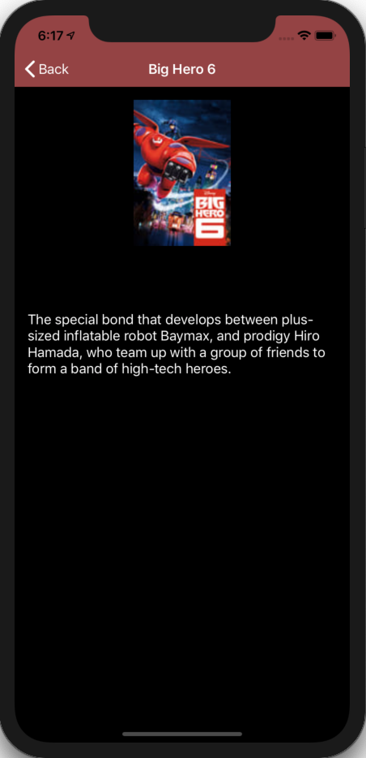

# Team Treehouse TechDegree Project 7

## Movie Night App

**App Description:**  Movie selection App.  2 users select from lists of genres, ratings and actors and, using The Movie Data Base API, provide suggested movie selections that satisfy both user’s preferences.

**Swift Features Used:**
Table Views (Data sources, Delegates), APIs, Asynchronous Networking, Generics, Operation Queues, JSON decoding, Navigation Controller.

**Screenshots:**

